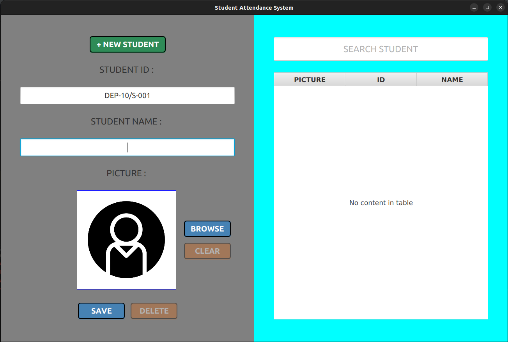

## Student Attendance System

This is a simple student attendance system implemented in Java with JavaFX and a MySQL database. The system generates student IDs automatically and allows you to save student photos along with their attendance records. Also any student can be searched.



## Features

- Automatic generation of student IDs.
- Ability to save student photos.
- User-friendly graphical user interface (GUI) using JavaFX.
- MySQL database integration for data storage.

## Requirements

To run this student attendance system, you need to have the following:

- Java Development Kit (JDK) 8 or above installed.
- MySQL database server installed and running.
- JavaFX SDK installed.

## Getting Started

Clone the repository:

   ```shell
   git clone https://github.com/RH-JavaFX-Projects/Student-Attendance-System.git


